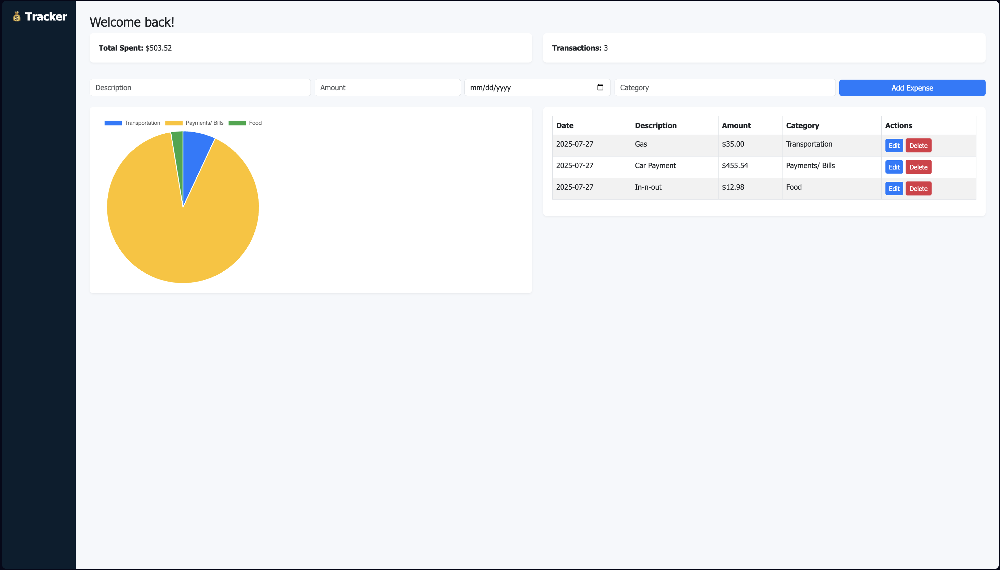

# 💰 Personal Finance Tracker

A clean and simple Flask-based web app that helps users manage daily expenses, visualize spending by category, and stay on top of their personal finances — all from one intuitive dashboard.



---

## 🚀 Features

- ✅ Add new expenses with date, description, amount, and category
- 🧾 Edit or delete any expense
- 📊 View a real-time pie chart of spending by category using Chart.js
- 💡 Clean, responsive layout for desktop and mobile
- 🗂 Persistent data storage using SQLite and SQLAlchemy

---

## 🛠 Built With

- [Python 3](https://www.python.org/)
- [Flask](https://flask.palletsprojects.com/)
- [HTML5 + CSS3](https://developer.mozilla.org/en-US/docs/Web/Guide)
- [Chart.js](https://www.chartjs.org/)
- [SQLite](https://www.sqlite.org/index.html) (via SQLAlchemy ORM)
- [Bootstrap](https://getbootstrap.com/) *(optional styling enhancements)*

---

## 📂 Project Structure

flask-finance-tracker/
├── static/
├── templates/
│ ├── index.html
│ └── edit.html
├── app.py
├── requirements.txt
├── screenshot.png
└── README.md

## ▶️ Getting Started

1. **Clone the repo**
   ```bash
   git clone https://github.com/yourusername/flask-finance-tracker.git
   cd flask-finance-tracker

## 🧪 Future Improvements

- User login system for personal accounts
- Filter expenses by category or date
- Export expenses as CSV or PDF
- Budget limits and alerts
- Dark mode

## 📄 License

MIT License — Free to use, modify, and share.

## ✨ Credits

Developed by Hadee Kroma with help from ChatGPT.

